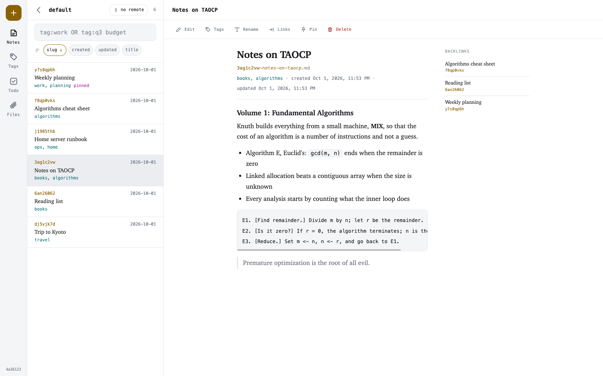
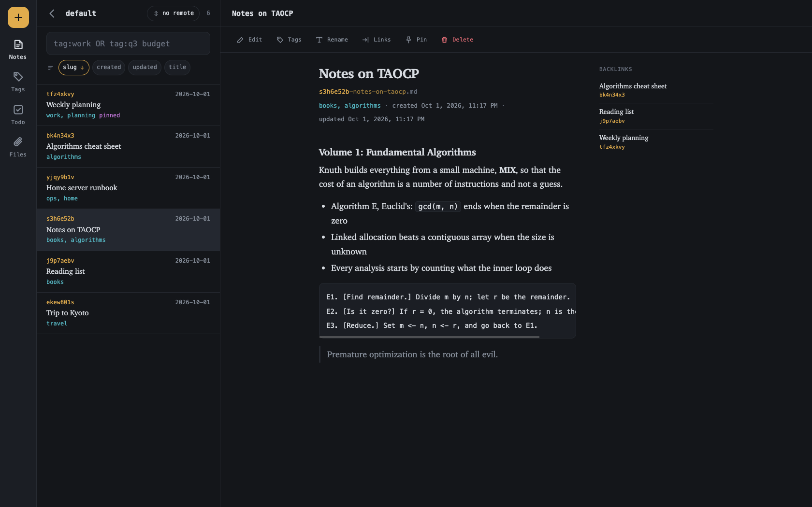
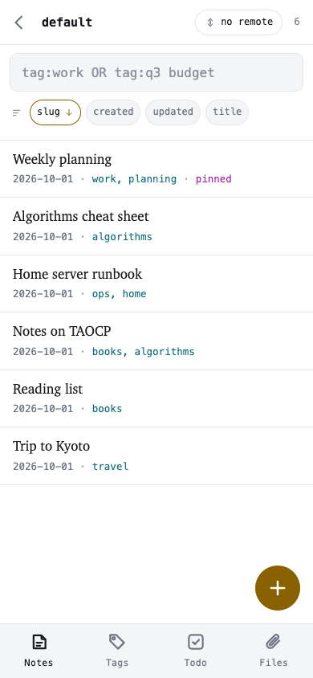
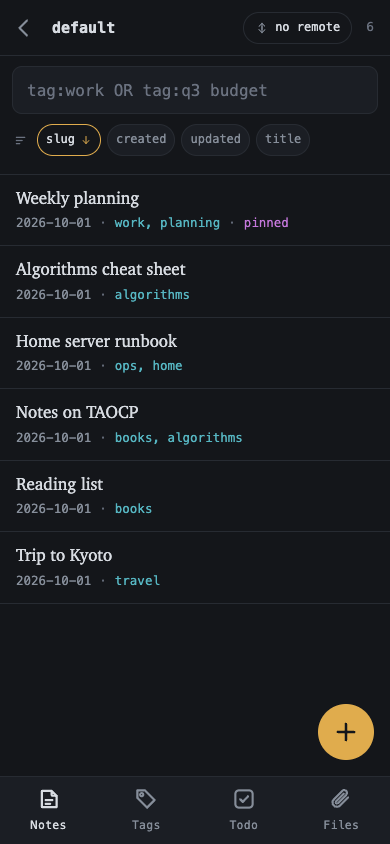

# noda - Git-native Notebook in Rust

> A git-native notebook for your terminal. Your notes are plain Markdown in an ordinary
> git repository — versioned, syncable, and yours.

[](https://github.com/henry40408/noda/actions/workflows/ci.yml)
[](https://github.com/henry40408/noda/releases/latest)
[](LICENSE.txt)
[](https://www.rust-lang.org/)
[](https://ghcr.io/henry40408/noda)
[](https://casuallymaintained.tech/)
[](https://claude.com/claude-code)

Local-first, plain-text, and built to start fast. No account, no index file, no lock-in.

`noda web`, on a monitor and on a phone:

| Light | Dark |
|-------|------|
|  |  |
|  |  |

## Features

- **Just git** - Every notebook is a normal git repo of Markdown files. Anything noda does,
  plain `git` can inspect and undo
- **Automatic history** - Every change is committed for you; `noda log` shows a note's
  history and `noda restore` rewinds it
- **Sync anywhere** - HTTPS and SSH are compiled in, so `noda sync` talks to any git host
  with nothing else to install
- **Fast to reach** - Address a note by a short id *or* a readable slug
- **Search** - Substring search over title, tags and body, with `tag:`, `OR` and `-` negation
- **Terminal UI** - `noda tui` to list, filter, open and edit without leaving the terminal
- **Web UI** - `noda web` serves the notebooks to a phone or browser; works with JavaScript off
- **Attachments & backlinks** - Link notes and files; links survive a retitle
- **Action items** - `- [ ]` boxes found across notes, read from the Markdown, never grepped
- **Import** - Bring in a TiddlyWiki 5 export
- **Signed commits** - Follows your git config's `commit.gpgsign` (OpenPGP)
- **One static binary** - Self-contained for macOS and Linux (incl. arm64/musl), plus a
  container image

## Quick Start

### Using Docker (Recommended)

A container image on GitHub's registry, for `linux/amd64` and `linux/arm64`. Notebooks live in
a volume, and the image runs `noda` directly:

```sh
docker pull ghcr.io/henry40408/noda:main
alias noda='docker run --rm -it -v noda:/data ghcr.io/henry40408/noda:main'
noda init
noda add "Meeting notes" -c "agenda"
```

<details>
<summary>The three things a container cannot do for you</summary>

`add` and `edit` open an editor, which the image does not carry — write notes with `-c`, or
mount one in. `sync` over SSH needs a key: pass your agent through with
`-v "$SSH_AUTH_SOCK:/ssh-agent" -e SSH_AUTH_SOCK=/ssh-agent`, or use an HTTPS remote with a
token. `noda tui` needs the `-it` the alias already carries; without a terminal, the command
says so.

</details>

### Building from Source

There is no crates.io package and no Homebrew formula:

```sh
git clone https://github.com/henry40408/noda.git
cd noda
cargo build --release        # target/release/noda
```

### First Notes

```sh
noda init                       # create XDG config/data dirs and a default notebook
noda add "Meeting notes"        # opens $EDITOR; auto-commits on save
noda ls                         # list notes in the current notebook
noda show k3f9                  # or: noda show meeting-notes
noda edit meeting-notes         # re-open in $EDITOR, auto-commits the change
noda tui                        # or browse the lot: list, filter, open, come back

noda notebook add work --remote git@github.com:me/work-notes.git
noda use work                   # switch active notebook
noda sync                       # pull + push over SSH/HTTPS
```

## Documentation

The reasoning behind a decision sits behind a ▸ or in one of the documents below.

**Guides** — [Command reference](docs/commands.md) · [Browsing in the terminal](docs/tui.md) · [In a browser](docs/web.md) · [History and sync](docs/history.md) · [Importing](docs/importing.md) · [Architecture](docs/ARCHITECTURE.md)

## Concepts

**Notebook.** A git repository under `$XDG_DATA_HOME/noda/notebooks/<name>/`. You can have
many; one is active at a time, and each has its own remote. A new notebook starts on the
branch your `init.defaultBranch` names.

**Note.** A Markdown file named `<id>-<slug>.md`. The **id** is a short code (Crockford base32,
e.g. `k3f9m2p1`) that never changes, even across renames. The **slug** is derived from the
title, follows a retitle, and is cut to 100 bytes at a word boundary. The filename is the
identity; there is no index.

Anywhere a command takes `<note>`, pass the id or the slug. A slug is matched whole; an id by
any prefix that names exactly one note, as git does with object ids, so `noda show k3f9` works.
Ambiguity is an error listing the candidates, never a guess.

<details>
<summary>Why the filename carries the identity, and how a mistyped id still lands</summary>

git will not put two entries under one path in a tree, so uniqueness is structural, and two
machines that each add a note write two different filenames that merge without a conflict.

Ids are lowercase and matched case-insensitively, and Crockford maps `I`/`L` to `1` and `O` to
`0`, so a mistyped id still resolves. Two notes may share a slug — the id keeps their filenames
apart — and then the slug alone is ambiguous, which is also why cutting a long slug cannot cause
a collision.

A filename gets 255 bytes, of which the id and `.md` spend 12. The cut is at 100 rather than
243 because `noda ls -l` pads the slug column to the widest slug. The full title stays in the
frontmatter.

</details>

**Frontmatter.** Having one is what marks a file as a note. noda reads these five fields and
leaves anything else in the block alone:

```
---
title: Reading notes on TAOCP
tags: [books, algorithms]
created: 2019-03-14T08:21:00Z
updated: 2024-11-02T16:40:12Z
pinned: true
---
```

`pinned` is normally absent: `noda pin` writes it and `noda unpin` removes the line, rather than
writing `false`.

`created` is set once; `updated` follows every change noda makes. `--no-touch` opts one command
out of that — on `edit`, `tag`, `pin`, `unpin`, `mv` and `restore` — for example on a note
imported with its own dates:

```
$ noda edit imported --no-touch          # the 2019 date it came with is still the date it has
$ noda tag imported --no-touch +archived
```

<details>
<summary>Writing your own dates, where <code>--no-touch</code> goes, and what noda will not invent</summary>

Anything RFC 3339 is read and kept as written, offset and all (`2019-03-14T16:21:00+08:00`
stays). noda writes UTC when it writes one itself. A note without the fields keeps not having
them: filesystem times do not survive a `clone`, and git only knows when a note reached *this*
notebook, so neither is a true `created`.

Renaming an attachment does not touch `updated` on the notes whose links it rewrites.

On `tag` the flag goes *before* the tags, which take every argument after them (so `-q3` is a
tag to remove); written after them, noda says where it belongs. On `restore`, `updated` comes
back with the rest of the version, so the note is byte for byte the copy asked for. `add` has no
such flag.

</details>

**History.** Every add/edit/rm is a commit, so `noda rm` is a commit you can revert.

## Commands

Every command, with its flags and what it prints, is in the **[command reference](docs/commands.md)**.

| Area | Commands |
| --- | --- |
| [Notebooks](docs/commands.md#notebooks) | `init` `notebook` `use` `status` `doctor` `clone` `readme` |
| [Notes](docs/commands.md#notes) | `add` `ls` `show` `edit` `rm` `mv` `tag` `pin` `unpin` `search` |
| [Attachments](docs/commands.md#attachments) | `file add` `file mv` `file rm` |
| [Paths](docs/commands.md#paths) | `path` |
| [Action items](docs/commands.md#action-items) | `todo` |
| [Backlinks](docs/commands.md#backlinks) | `backlinks` |
| [History](docs/commands.md#history-git-backed) | `log` `blame` `diff` `deleted` `snapshot` `restore` |
| [Remote sync](docs/commands.md#remote-sync-https--ssh) | `remote` `sync` `push` `pull` |
| [Config](docs/commands.md#config) | `config` |
| [Importing](docs/commands.md#importing) | `import tiddlywiki` |
| [Terminal UI](docs/tui.md) / [Browser](docs/web.md) | `tui` `web` |

## Roadmap

Encrypted notebooks are under consideration.

## Building from source

```sh
cargo build --release
# Cross-compile static Linux binaries (requires zig + cargo-zigbuild):
cargo zigbuild --release --target x86_64-unknown-linux-musl
cargo zigbuild --release --target aarch64-unknown-linux-musl

cargo nextest run
scripts/bench-coldstart.sh                # times whole processes, not in-process code
```

`noda --version` reports the tag the build came from via `git describe` at compile time (`0.2.0`,
or `0.2.0-3-gabc1234` three commits later), not `Cargo.toml`'s placeholder `0.1.0`. The container
build has no `.git`, so it is passed a `NODA_VERSION` build argument instead.

libgit2, OpenSSL and libssh2 are vendored into one static binary. Startup time is a feature, so
the release profile is tuned for size and cold start is measured. How the crate fits together:
[docs/ARCHITECTURE.md](docs/ARCHITECTURE.md).

## Tech Stack

- **Git**: git2 (libgit2, OpenSSL and libssh2 vendored)
- **CLI**: clap
- **Terminal UI**: ratatui
- **Web**: axum on tokio
- **Markdown**: pulldown-cmark
- **Config**: toml_edit
- **Import**: serde_json
- **Time**: jiff

## License

[MIT](LICENSE.txt) © 2026 Heng-Yi Wu
